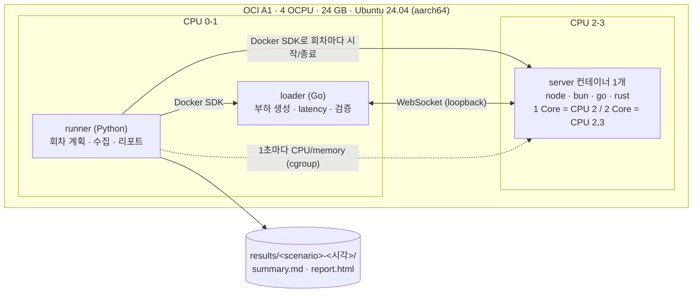
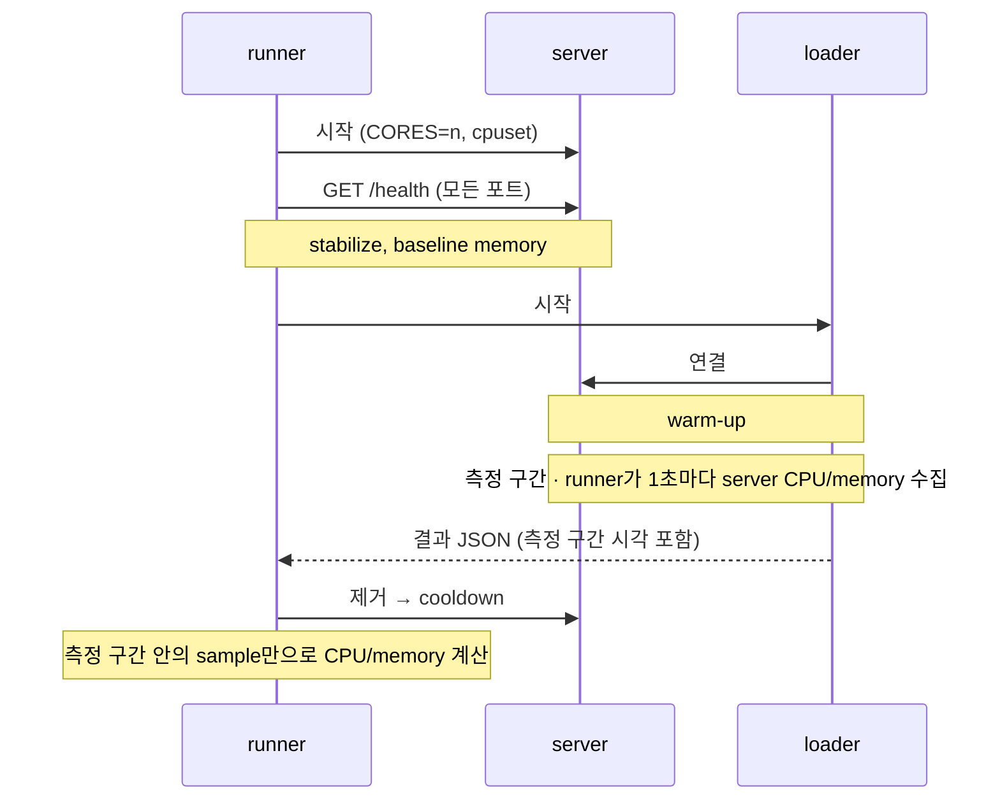
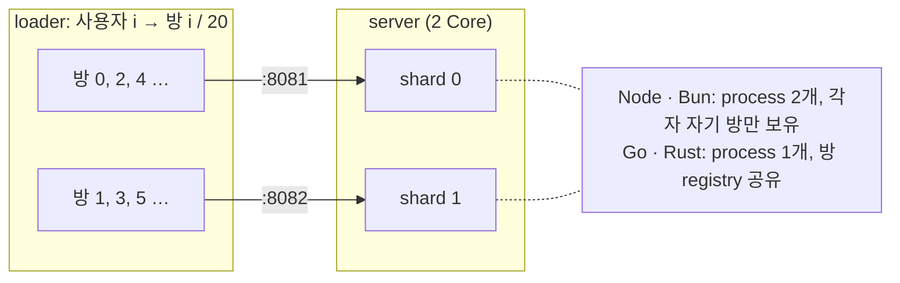

# WebSocket Backend Benchmark

같은 CPU(1 Core / 2 Core)를 준 Node, Bun, Go, Rust의 WebSocket 서버를 두 가지로 비교한다.

- **echo**: 메시지를 그대로 돌려줄 때의 throughput, latency, CPU, memory
- **room**: wpixel처럼 방 안의 사용자들이 JSON 메시지를 주고받고 서버가 방 전체에 즉시 broadcast할 때, 품질 기준(SLO)을 지키며 버티는 **최대 동시 사용자 수**

호스트에 필요한 것은 Docker(Compose v2)와 [Task](https://taskfile.dev)뿐이다. 서버, loader, runner 모두 컨테이너다.

## 결과

2026-10-04, OCI A1 (aarch64) 4 OCPU에서 측정했다. 서버는 CPU 2(,3), loader는 CPU 0,1을 쓴다.

### 최대 동시 사용자 수 (room)

방당 20명, 사용자당 5초에 1번 메시지. SLO는 전달 p99 ≤ 100ms, 누락 0, 접속 실패 0이다. 사용자 수를 1k → 2k → 5k → 10k → 20k → 40k로 올려 3회 중 다수가 SLO를 지킨 가장 높은 단계다.

| runtime | 1 Core | 2 Core | 사용자당 memory |
|---|--:|--:|--:|
| bun | **≥ 40,000** | **≥ 40,000** | 7 KB |
| rust | 20,000 | **≥ 40,000** | 142 KB |
| go | 10,000 | 20,000 | 56 KB |
| node | 5,000 | 10,000 | 26 KB |

- `≥`는 마지막 단계(40k)까지 통과해서 실제 한계가 더 높다는 뜻이다. bun 1 Core는 40k에서 CPU 0.99코어로 거의 한계였다.
- 133회차 모두 누락·순서 오류 0. 실패는 전부 p99 초과였고, 그때 서버는 할당 코어를 다 쓰고 있었다(loader는 여유). 즉 서버 CPU 한계다.
- rust는 40k에서 memory 5.5 GB를 썼다(tungstenite 기본 버퍼).

### echo throughput

payload 64B, 연결 100, 5회 median.

| runtime | 1 Core msg/s | 2 Core msg/s | 1 Core p99 |
|---|--:|--:|--:|
| rust | 83,624 | ≥ 140,846 | 2.8 ms |
| bun | 69,546 | 132,350 | 1.8 ms |
| go | 41,640 | 98,137 | 5.2 ms |
| node | 27,291 | 63,046 | 4.6 ms |

- `≥`는 loader가 포화된 조건이다(서버보다 loader가 먼저 한계). rust 2 Core는 모든 조건에서, 16KB payload는 bun·rust에서 대부분 그랬다.
- 240회차 모두 valid. 전체 조건(연결 100/1000 × 64B/1KB/16KB)은 `results/<session>/summary.md`와 `report.html`에 있다.

## 구성



한 시점에 서버는 하나만 뜬다. 회차 하나는 이렇게 진행된다.



### room 테스트 (임시! 완성 된 항목 아닙니다.)

방 r의 사용자는 `PORT+1+(r % CORES)` 포트로 접속한다. 같은 방은 항상 같은 shard에 모인다(방 단위로 묶어주는 load balancer를 흉내 낸 것).



```text
입장      server → {"t":"hello","u":17,"v":4812,"recent":[최근 20개]}
보내기    client → {"t":"msg","s":12,"body":"..."}
broadcast server → 방 전체 {"t":"msg","u":17,"s":12,"v":4813,"body":"..."}
잘못된 것 server → {"t":"err","code":"invalid"}
```

- 사용자당 5초에 1번(0.2회/s), 방당 20명. 초당 전달 수 = 사용자 수 × 4
- loader는 보낸 시각부터 같은 방 사용자가 받기까지(전달 latency)를 하나의 시계로 재고, 방 버전(v)으로 누락과 순서 오류를 검사한다.
- 사용자 수를 단계별로 올리며, 단계마다 **전달 p99 ≤ 100ms, 누락/순서 오류 0, 접속 실패 0, 목표 송신량 유지**를 지키는지 본다. 실패하면 그 위 단계는 건너뛴다.
- 구현은 각 생태계의 기본 방식이다. Bun은 내장 pub/sub(`server.publish`), Node는 멤버마다 `send`, Go와 Rust는 멤버마다 큐와 쓰기 작업을 둔다. 프로토콜은 `loader/room.go` 상단 주석에 있다.

## 실행

```bash
cp .env.example .env      # CPU 배치 (기본: OCI A1 4 OCPU)
task build                # 이미지 6개: node bun go rust loader runner
task smoke                # echo 파이프라인 점검, 약 2분
task bench SCENARIO=echo-throughput
task bench SCENARIO=room-capacity
```

결과는 `results/<scenario>-<UTC 시각>/`에 쌓이고, `report.html`(그래프)과 `summary.md`(표)가 함께 생긴다.
일부만: `task bench SCENARIO=room-capacity -- --servers go,rust --runs 1`

| Scenario | 내용 |
|---|---|
| `smoke`, `room-smoke` | 파이프라인 점검. 수치 비교 금지 |
| `echo-throughput` | 연결 100/1000 × payload 64B/1KB/16KB × 1/2 Core × 5회 |
| `echo-rate` | 10k–100k msg/s 고정 rate에서 latency |
| `idle` | 연결 1k/5k/10k 유지, 연결당 memory |
| `room-capacity` | 사용자 1k–40k 단계 × 1/2 Core × 3회 |

| Runtime | echo | room | 2 Core |
|---|---|---|---|
| node | Node.js 24 + ws 8.18 | 멤버마다 `send` | `cluster` worker 2개 |
| bun | Bun 1.4.2 + `Bun.serve` | pub/sub `publish` | process 2개 |
| go | Go 1.24 + coder/websocket | 멤버별 큐 + writer goroutine | `GOMAXPROCS=2` |
| rust | axum 0.8 (Tokio) | 멤버별 channel + writer task | `worker_threads=2` |

## 알아둘 점

- **loader 한계**: loader와 서버가 메시지당 하는 일이 비슷해서(대부분 커널 TCP 처리), loader 2코어로는 가장 빠른 2 Core 서버의 상한을 다 못 잴 수 있다. 이런 회차는 `loader_saturated`로 표시하고, 리포트에서 "최소 이만큼"(≥)으로 본다.
- **loader만 AppArmor 해제**: Docker 기본 AppArmor 검사가 loader CPU의 약 8%를 썼다(perf 측정). 측정 대상이 아닌 loader에만 `apparmor=unconfined`를 준다.
- **Rust 연결당 memory**: tungstenite의 기본 read buffer(128 KiB) 때문에 크다. 기본값을 그대로 둔다.
- **Node 기본 설정**: `ws`의 선택 애드온(`bufferutil`)을 넣지 않아 마스크 처리를 JS로 한다.
