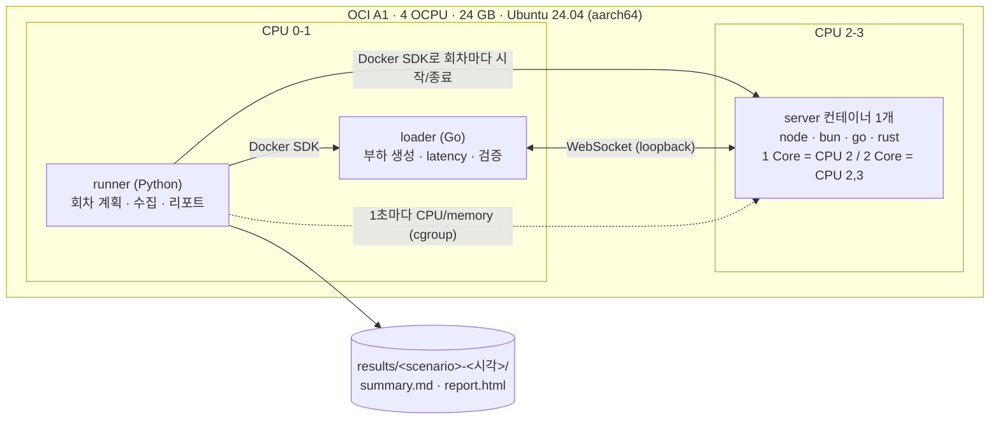
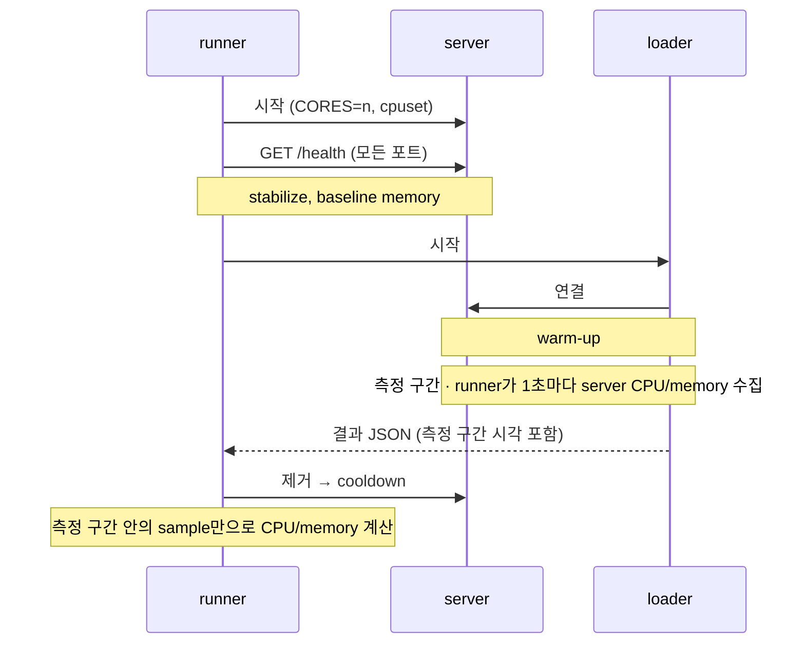
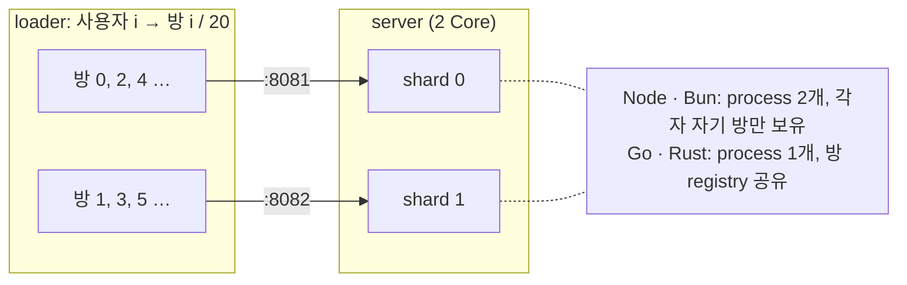

# WebSocket Backend Benchmark

같은 CPU(1 / 2 Core)에서 Node, Bun, Go, Rust WebSocket 서버 비교.

- **echo**: 단순 echo 서버의 throughput과 latency
- **room (WIP)**: wpixel식 방 broadcast에서 SLO를 지키는 최대 동시 사용자 수

구성, 테스트 설계, 주의점: [docs/methodology.ko.md](docs/methodology.ko.md)

## 결과

2026-10-04, OCI A1 (aarch64, 4 OCPU). 서버 CPU 2(,3), loader CPU 0,1.

### echo throughput

payload 64B, 연결 100, 5회 median.

| runtime | 1 Core msg/s | 2 Core msg/s | 1 Core p99 |
|---|--:|--:|--:|
| rust | 83,624 | ≥ 140,846 | 2.8 ms |
| bun | 69,546 | 132,350 | 1.8 ms |
| go | 41,640 | 98,137 | 5.2 ms |
| node | 27,291 | 63,046 | 4.6 ms |

`≥` = loader가 먼저 포화. 다른 조건: `results/<session>/summary.md`

### 최대 동시 사용자 수 (room)

> **WIP**: room 테스트는 아직 완성되지 않았다. 수치는 참고용입니다.

방당 20명, 사용자당 5초에 1번. SLO: 전달 p99 ≤ 100ms, 누락 0, 접속 실패 0. 1k–40k 단계에서 3회 중 2회 이상 통과한 최고 단계.

| runtime | 1 Core | 2 Core | 사용자당 memory |
|---|--:|--:|--:|
| bun | **≥ 40,000** | **≥ 40,000** | 7 KB |
| rust | 20,000 | **≥ 40,000** | 142 KB |
| go | 10,000 | 20,000 | 56 KB |
| node | 5,000 | 10,000 | 26 KB |

`≥` = 마지막 단계(40k) 통과. 실패는 전부 서버 CPU 한계.

### Runtime

| runtime | echo | room | 2 Core |
|---|---|---|---|
| node | Node.js 24 + ws 8.18 | 멤버마다 `send` | `cluster` worker 2개 |
| bun | Bun 1.4.2 + `Bun.serve` | pub/sub `publish` | process 2개 |
| go | Go 1.24 + coder/websocket | 멤버별 큐 + writer goroutine | `GOMAXPROCS=2` |
| rust | axum 0.8 (Tokio) | 멤버별 channel + writer task | `worker_threads=2` |

## 구성



한 시점에 서버는 하나만 뜹니다. 회차 하나의 흐름:



### room shard 배치 (임시)

방 r은 `PORT+1+(r % CORES)` 포트로 접속해서, 같은 방은 항상 같은 shard에 모입니다.



## 실행

Docker(Compose v2)와 [Task](https://taskfile.dev)가 필요합니다.

```bash
cp .env.example .env      # CPU 배치 (기본: OCI A1 4 OCPU)
task build
task smoke                # 파이프라인 점검, 약 2분
task bench SCENARIO=echo-throughput
task bench SCENARIO=room-capacity
```

결과: `results/<scenario>-<UTC 시각>/` (`summary.md`, `report.html`). Scenario 목록: [docs/methodology.ko.md](docs/methodology.ko.md#scenario)
