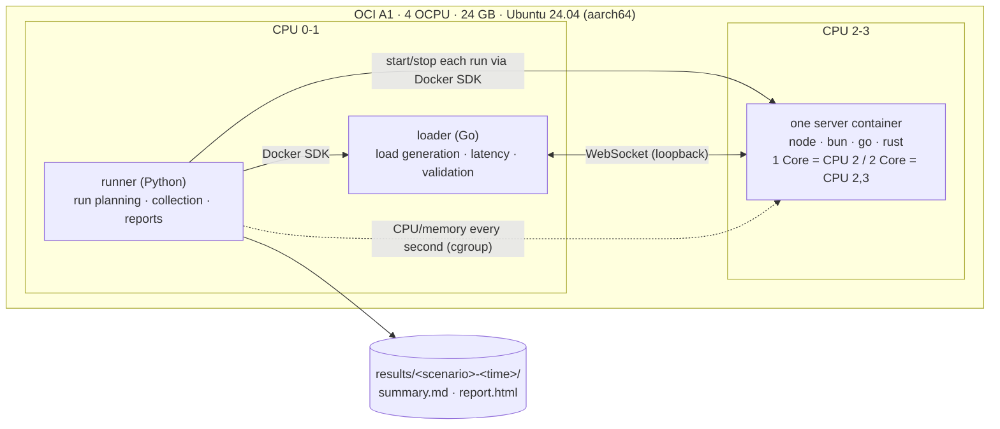
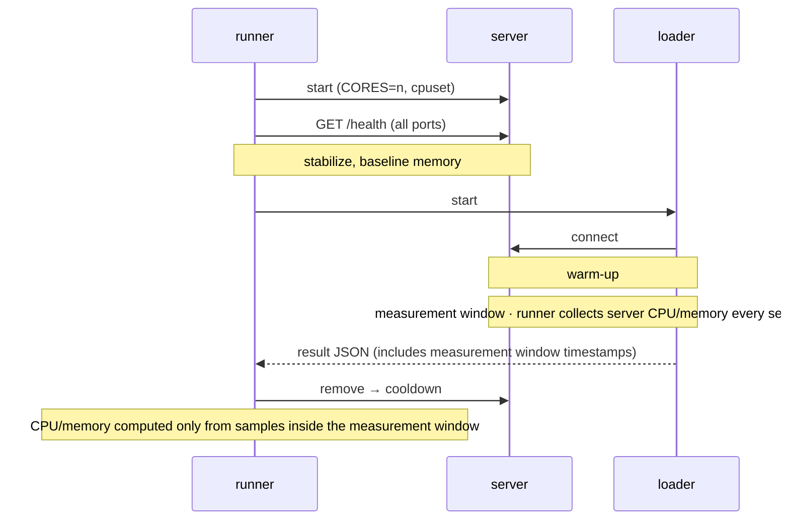
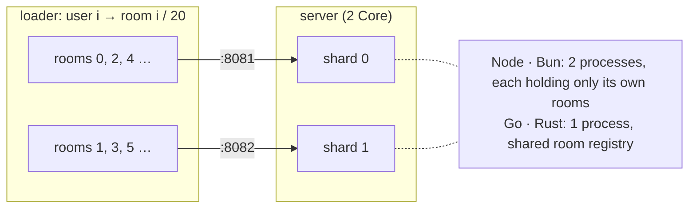

# Simple WebSocket Backend Benchmark

Node, Bun, Go, and Rust WebSocket servers compared on the same CPU budget (1 / 2 cores).

- **echo**: throughput and latency of a plain echo server
- **room (WIP)**: max concurrent users under an SLO, with wpixel-style room broadcast

Setup, test design, and caveats: [docs/methodology.md](docs/methodology.md)

## Results

2026-10-04, OCI A1 (aarch64, 4 OCPU). Server on CPU 2(,3), loader on CPU 0,1.

### echo throughput

64 B payload, 100 connections, median of 5 runs.

| runtime | 1 Core msg/s | 2 Core msg/s | 1 Core p99 |
|---|--:|--:|--:|
| rust | 83,624 | ≥ 140,846 | 2.8 ms |
| bun | 69,546 | 132,350 | 1.8 ms |
| go | 41,640 | 98,137 | 5.2 ms |
| node | 27,291 | 63,046 | 4.6 ms |

`≥` = loader saturated first. Other conditions: `results/<session>/summary.md`.

### Max concurrent users (room)

> **WIP**: the room test is not final. Treat these numbers as provisional.

20 users/room, 1 msg per 5 s each. SLO: delivery p99 ≤ 100 ms, no lost messages, no connection failures. Highest of 1k–40k steps passed by 2 of 3 runs.

| runtime | 1 Core | 2 Core | memory per user |
|---|--:|--:|--:|
| bun | **≥ 40,000** | **≥ 40,000** | 7 KB |
| rust | 20,000 | **≥ 40,000** | 142 KB |
| go | 10,000 | 20,000 | 56 KB |
| node | 5,000 | 10,000 | 26 KB |

`≥` = passed the top step (40k). Every failure was server CPU bound.

### Runtimes

| runtime | echo | room | 2 Core |
|---|---|---|---|
| node | Node.js 24 + ws 8.18 | `send` per member | 2 `cluster` workers |
| bun | Bun 1.4.2 + `Bun.serve` | pub/sub `publish` | 2 processes |
| go | Go 1.24 + coder/websocket | per-member queue + writer goroutine | `GOMAXPROCS=2` |
| rust | axum 0.8 (Tokio) | per-member channel + writer task | `worker_threads=2` |

## Setup



Only one server runs at a time. A single run:



### Room sharding (provisional)

Room r connects to port `PORT+1+(r % CORES)`, so a room always lands on the same shard.



## Running

Requires Docker (Compose v2) and [Task](https://taskfile.dev).

```bash
cp .env.example .env      # CPU layout (default: OCI A1 4 OCPU)
task build
task smoke                # ~2 min pipeline check
task bench SCENARIO=echo-throughput
task bench SCENARIO=room-capacity
```

Output: `results/<scenario>-<UTC time>/` (`summary.md`, `report.html`). Scenario list: [docs/methodology.md](docs/methodology.md#scenarios)
