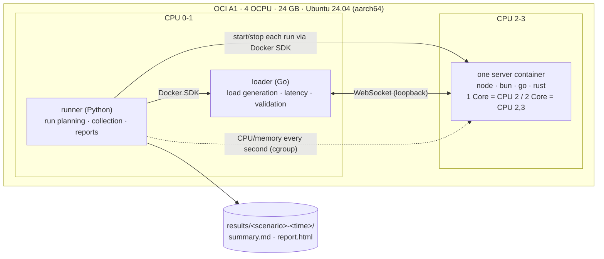
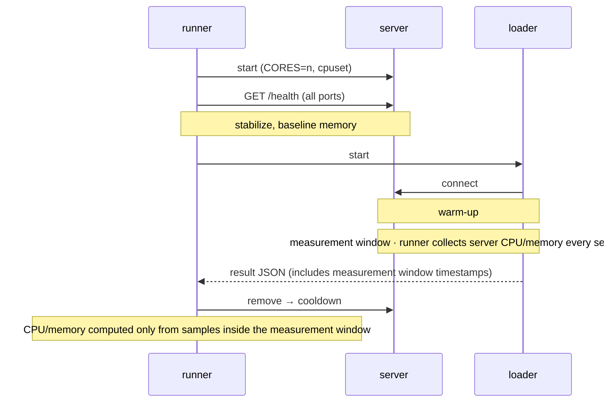
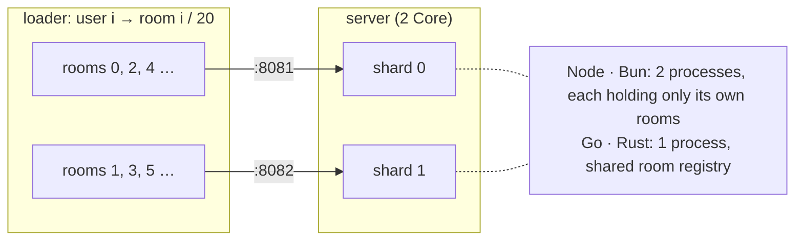

# Simple WebSocket Backend Benchmark

Compares WebSocket servers written in Node, Bun, Go, and Rust, each given the same CPU (1 Core / 2 Core), in two ways:

- **echo**: throughput, latency, CPU, and memory when the server sends each message straight back
- **room (WIP)**: the **maximum number of concurrent users** a server can hold while meeting the quality targets (SLO), when users in a room exchange JSON messages and the server immediately broadcasts each one to the whole room, as in wpixel

The host only needs Docker (Compose v2) and [Task](https://taskfile.dev). The servers, loader, and runner all run in containers.

## Results

Measured on 2026-10-04 on OCI A1 (aarch64) with 4 OCPUs. The server uses CPU 2(,3) and the loader uses CPUs 0,1.

### Maximum concurrent users (room)

20 users per room, each sending 1 message every 5 seconds. The SLO is delivery p99 ≤ 100ms, zero lost messages, and zero connection failures. The user count goes 1k → 2k → 5k → 10k → 20k → 40k, and each cell is the highest step at which the majority of 3 runs met the SLO.

| runtime | 1 Core | 2 Core | memory per user |
|---|--:|--:|--:|
| bun | **≥ 40,000** | **≥ 40,000** | 7 KB |
| rust | 20,000 | **≥ 40,000** | 142 KB |
| go | 10,000 | 20,000 | 56 KB |
| node | 5,000 | 10,000 | 26 KB |

- `≥` means the server passed the last step (40k), so its real limit is higher. bun on 1 Core was close to its limit at 40k, using 0.99 cores of CPU.
- All 133 runs had zero lost or out-of-order messages. Every failure was a p99 overrun, and in each case the server was using all of its assigned cores while the loader had headroom. In other words, the limit was server CPU.
- rust used 5.5 GB of memory at 40k (tungstenite's default buffers).

### echo throughput

64B payload, 100 connections, median of 5 runs.

| runtime | 1 Core msg/s | 2 Core msg/s | 1 Core p99 |
|---|--:|--:|--:|
| rust | 83,624 | ≥ 140,846 | 2.8 ms |
| bun | 69,546 | 132,350 | 1.8 ms |
| go | 41,640 | 98,137 | 5.2 ms |
| node | 27,291 | 63,046 | 4.6 ms |

- `≥` marks conditions where the loader was saturated (the loader hit its limit before the server). This was true for rust on 2 Core in every condition, and for most 16KB-payload runs on bun and rust.
- All 240 runs were valid. Results for every condition (100/1000 connections × 64B/1KB/16KB) are in `results/<session>/summary.md` and `report.html`.

## Setup



Only one server runs at a time. A single run goes like this:



### room test (Provisional! This section is not finalized.)

Users in room r connect to port `PORT+1+(r % CORES)`. The same room always lands on the same shard (mimicking a load balancer that groups connections by room).



```text
join       server → {"t":"hello","u":17,"v":4812,"recent":[last 20]}
send       client → {"t":"msg","s":12,"body":"..."}
broadcast  server → whole room {"t":"msg","u":17,"s":12,"v":4813,"body":"..."}
invalid    server → {"t":"err","code":"invalid"}
```

- Each user sends 1 message every 5 seconds (0.2/s), with 20 users per room. Deliveries per second = user count × 4
- The loader measures the time from send until another user in the same room receives the message (delivery latency) on a single clock, and uses the room version (v) to check for lost and out-of-order messages.
- The user count is raised step by step, and each step is checked for **delivery p99 ≤ 100ms, zero lost/out-of-order messages, zero connection failures, and sustained target send rate**. If a step fails, the steps above it are skipped.
- Each implementation uses its ecosystem's default approach. Bun uses its built-in pub/sub (`server.publish`), Node calls `send` for each member, and Go and Rust give each member its own queue and writer task. The protocol is documented in the header comment of `loader/room.go`.

## Running

```bash
cp .env.example .env      # CPU layout (default: OCI A1 4 OCPU)
task build                # 6 images: node bun go rust loader runner
task smoke                # checks the echo pipeline, about 2 minutes
task bench SCENARIO=echo-throughput
task bench SCENARIO=room-capacity
```

Results are written to `results/<scenario>-<UTC time>/`, together with `report.html` (charts) and `summary.md` (tables).
To run a subset: `task bench SCENARIO=room-capacity -- --servers go,rust --runs 1`

| Scenario | Description |
|---|---|
| `smoke`, `room-smoke` | Pipeline check. Do not compare the numbers |
| `echo-throughput` | 100/1000 connections × 64B/1KB/16KB payload × 1/2 Core × 5 runs |
| `echo-rate` | Latency at fixed rates of 10k–100k msg/s |
| `idle` | Hold 1k/5k/10k connections, memory per connection |
| `room-capacity` | 1k–40k user steps × 1/2 Core × 3 runs |

| Runtime | echo | room | 2 Core |
|---|---|---|---|
| node | Node.js 24 + ws 8.18 | `send` per member | 2 `cluster` workers |
| bun | Bun 1.4.2 + `Bun.serve` | pub/sub `publish` | 2 processes |
| go | Go 1.24 + coder/websocket | per-member queue + writer goroutine | `GOMAXPROCS=2` |
| rust | axum 0.8 (Tokio) | per-member channel + writer task | `worker_threads=2` |

## Notes

- **Loader limits**: The loader does about as much work per message as the server (mostly kernel TCP processing), so a 2-core loader may not be able to find the ceiling of the fastest 2 Core servers. Such runs are flagged `loader_saturated`, and the report treats them as "at least this much" (≥).
- **AppArmor disabled for the loader only**: Docker's default AppArmor checks used about 8% of the loader's CPU (measured with perf). Only the loader, which is not under test, gets `apparmor=unconfined`.
- **Rust memory per connection**: It is high because of tungstenite's default read buffer (128 KiB). The default is left as is.
- **Node default settings**: `ws`'s optional add-on (`bufferutil`) is not installed, so masking is done in JS.
