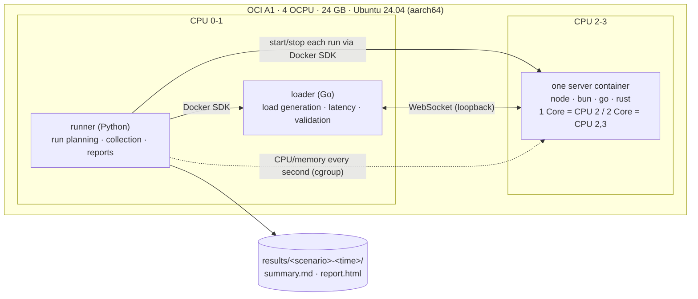
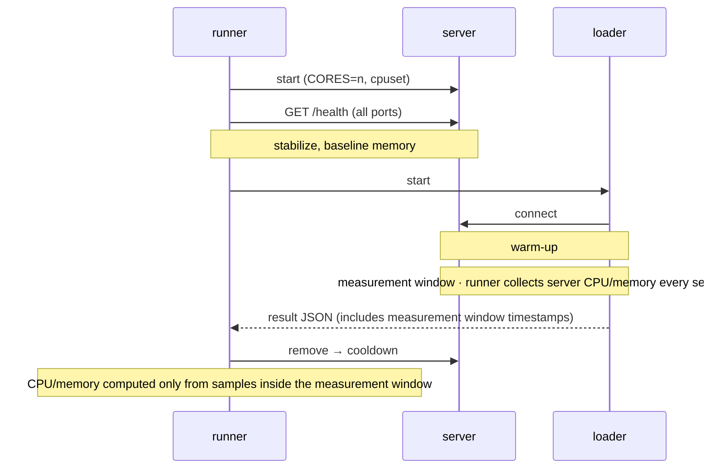
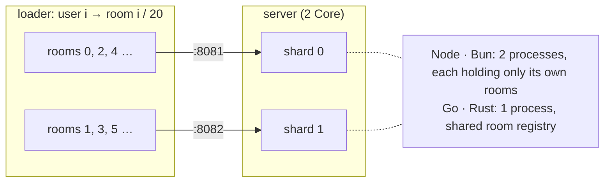

# Methodology

The host only needs Docker (Compose v2) and [Task](https://taskfile.dev). The servers, loader, and runner all run in containers.

## Setup



Only one server runs at a time. A single run:



## Room test (provisional)

Users in room r connect to port `PORT+1+(r % CORES)`, so a room always lands on the same shard (like a load balancer that groups connections by room).



```text
join       server → {"t":"hello","u":17,"v":4812,"recent":[last 20]}
send       client → {"t":"msg","s":12,"body":"..."}
broadcast  server → whole room {"t":"msg","u":17,"s":12,"v":4813,"body":"..."}
invalid    server → {"t":"err","code":"invalid"}
```

- 20 users per room, each sending 1 message every 5 s. Deliveries/s = users × 4.
- Delivery latency = send → received by another user in the room, measured on one clock in the loader. The room version (`v`) detects lost and out-of-order messages.
- Each step must meet: **delivery p99 ≤ 100 ms, zero lost/out-of-order messages, zero connection failures, target send rate sustained**. Steps above a failed step are skipped.
- Each server uses its ecosystem's default approach: Bun's built-in pub/sub (`server.publish`), Node `send` per member, Go/Rust a queue and writer task per member. The protocol is documented at the top of `loader/room.go`.

## Scenarios

| Scenario | Description |
|---|---|
| `smoke`, `room-smoke` | Pipeline check. Do not compare the numbers |
| `echo-throughput` | 100/1000 connections × 64B/1KB/16KB payload × 1/2 Core × 5 runs |
| `echo-rate` | Latency at fixed rates of 10k–100k msg/s |
| `idle` | Hold 1k/5k/10k connections, memory per connection |
| `room-capacity` | 1k–40k user steps × 1/2 Core × 3 runs |

To run a subset: `task bench SCENARIO=room-capacity -- --servers go,rust --runs 1`

## Result notes (2026-10-04)

- room: bun on 1 Core used 0.99 cores at 40k, so it was close to its limit.
- room: all 133 runs had zero lost or out-of-order messages. Every failure was a p99 overrun with the server using all its cores while the loader had headroom, i.e. server CPU was the limit.
- room: rust used 5.5 GB at 40k (tungstenite's default buffers).
- echo: rust on 2 Core was loader-saturated in every condition, as were most 16KB runs for bun and rust.
- echo: all 240 runs were valid.

## Caveats

- **Loader limits**: the loader does about as much work per message as the server (mostly kernel TCP), so a 2-core loader may not find the ceiling of the fastest 2 Core servers. Such runs are flagged `loader_saturated` and shown as `≥`.
- **AppArmor disabled for the loader only**: Docker's default AppArmor cost about 8% of loader CPU (perf). Only the loader, which is not under test, gets `apparmor=unconfined`.
- **Rust memory per connection**: high because of tungstenite's default 128 KiB read buffer. Left at the default.
- **Node defaults**: `ws`'s optional `bufferutil` add-on is not installed, so masking is done in JS.
